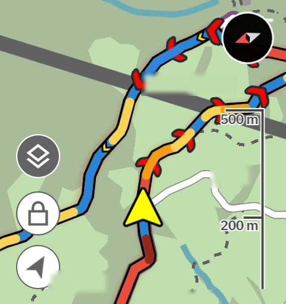
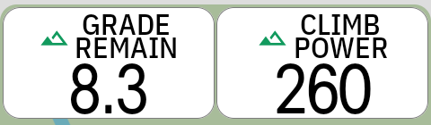
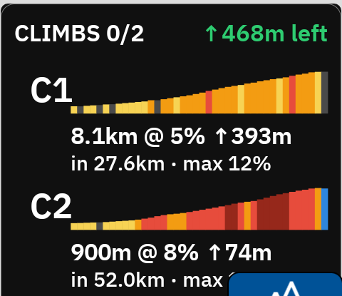
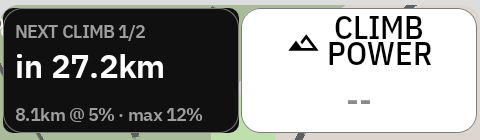
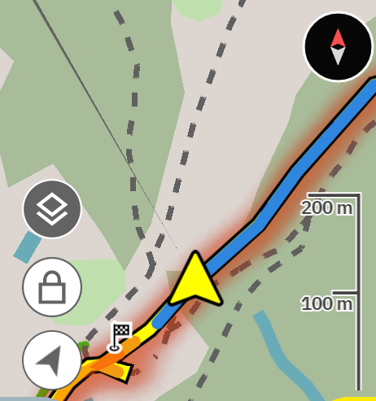

# ClimbSense — climbing data fields & gradient map overlay for Hammerhead Karoo

[](https://github.com/rtaylorgraham/karoo-climbsense/actions)
[](LICENSE)

A [Karoo extension](https://www.hammerhead.io/pages/developer-platform) that closes
the gap with Garmin's ClimbPro: the climb metrics the native Climber doesn't show,
a climb list you can actually see mid-climb, and a map painted by gradient.

> **Beta.** ClimbSense is in open beta - everything below works and has been
> validated on a Karoo 3 with simulated and real rides, but so far on one
> device and one rider's routes. Bug reports, field ideas, and feature requests
> are very welcome:
> [open an issue](https://github.com/rtaylorgraham/karoo-climbsense/issues).

## Features

<table>
<tr>
<td width="52%" valign="top">
<h3>Gradient map overlay</h3>
The route is painted by steepness, so you read the hard sections and the
recovery sections at a glance — before you reach them:

<br/><br/>
🟨 <b>2–5%</b> &nbsp; 🟧 <b>5–8%</b> &nbsp; 🟥 <b>8–12%</b> &nbsp; 🟫 <b>12%+</b> &nbsp; 🟦 <b>descent</b>
<br/><br/>

Flats stay unpainted so the underlying map stays readable. Climb starts get
labeled markers and summits get flags. Enabled automatically whenever you're
following a route with elevation data.
</td>
<td valign="top"></td>
</tr>
<tr>
<td valign="top">
<h3>Grade Remain &amp; Climb Power</h3>
<b>Grade Remain</b> is Garmin ClimbPro's "Grad Remain" for the Karoo: the
average gradient from your wheel to the top of the current climb,
recalculating as you ascend. Burn off the easy half and watch the number
tell you what's really left.<br/><br/>
<b>Climb Power</b> is your average power since the climb started — the
number to pace a long effort against. Both show <code>--</code> when
you're not climbing.
</td>
<td valign="top"></td>
</tr>
<tr>
<td valign="top">
<h3>Climb List — visible mid-climb</h3>
Every climb on the route with live states: ✓ done, ▶ current (with a
progress cursor and distance/ascent to the top), and upcoming with
distance-to-start. Each row shows a gradient-colored mini profile, length,
average grade, total ascent, and <b>max pitch</b> — a stat the native list
doesn't have. The header totals the ascent still ahead of you. Put it on a
single-field page layout and it's one swipe away at any moment — including
mid-climb, where the native list is hardest to reach.
</td>
<td valign="top"></td>
</tr>
<tr>
<td valign="top">
<h3>Next Climb tile</h3>
A glanceable preview of what's coming: distance to the next climb, its
length, average grade, and max pitch. When you hit the base it flips to
live <b>ON CLIMB</b> status with a colored profile and distance/ascent to
the top.
</td>
<td valign="top"></td>
</tr>
<tr>
<td valign="top">
<h3>Summit in sight</h3>
Past the top, the overlay shows the descent in blue and the summit flag
behind you — and every climb field quietly returns to <code>--</code>
until the next one.
</td>
<td valign="top"></td>
</tr>
</table>

**Also included:** **Max Ahead** (steepest ~100 m pitch still remaining in the
current climb) and **Next 500m** (average gradient of the next 500 m on any
terrain, negative on descents) as plain numeric fields.

## Install

1. Download the latest `climbsense.apk` from
   [Releases](https://github.com/rtaylorgraham/karoo-climbsense/releases).
2. **Karoo 3**: share the APK link to the Hammerhead Companion app on your phone and
   accept the install prompt on the Karoo
   ([sideloading guide](https://support.hammerhead.io/hc/en-us/articles/31576497036827-Companion-App-Sideloading)),
   or install over USB: `adb install climbsense.apk`.
3. Add the fields: long-press any data field on a ride page → find **ClimbSense**.
   For the Climb List, create a page with the single-field layout.

Requires Karoo OS ≥ 1.634.2440 (karoo-ext 1.1.9).

## Notes & limitations

- The profile-based fields (Max Ahead, Next 500m, Next Climb, Climb List, overlay)
  need an actively followed **route** — the SDK only exposes elevation data for
  loaded routes, so routeless "Predictive Path" climbs aren't supported.
- Grade Remain and Climb Power work from the Karoo's own climb stream (with a
  route-profile fallback for Grade Remain), so they behave exactly like the native
  TO TOP values — even if route matching momentarily reports off-route.
- Fields show `--` when there's no meaningful value (off-climb, no route,
  off-route, or inside the last ~20 m of a climb) — never a misleading number.
- After sideloading an update over USB, reboot the Karoo: its extension manager
  caches stream registrations and fields can show "No Sensor" until a reboot.

## How it's built

Kotlin + the official [karoo-ext](https://github.com/hammerheadnav/karoo-ext) SDK.
All math (polyline decoding, elevation profile interpolation, climb detection
bookkeeping, gradient segmentation, per-climb power averaging) is pure JVM code with
a test-first suite (`./gradlew testDebugUnitTest`). Rendering is Canvas → RemoteViews;
the map layer uses the SDK's polyline/symbol effects. Extensively validated on-device
with simulated rides via [karoo-ride-replay](https://github.com/lgangitano/karoo-ride-replay),
including watt-exact validation of Climb Power against synthetic FIT power data.

```
./gradlew testDebugUnitTest assembleDebug
adb install -r app/build/outputs/apk/debug/app-debug.apk
```

JDK 17 + Android SDK required. karoo-ext resolves via JitPack — no tokens needed.

## Credits

- [hammerheadnav/karoo-ext](https://github.com/hammerheadnav/karoo-ext) — the official extension SDK (Apache-2.0)
- [lgangitano/karoo-ride-replay](https://github.com/lgangitano/karoo-ride-replay) — invaluable for couch-side validation
- [timklge/awesome-karoo](https://github.com/timklge/awesome-karoo) — the community extension index

Not affiliated with Hammerhead or SRAM. Karoo is a trademark of SRAM LLC.

## License

[Apache-2.0](LICENSE)
